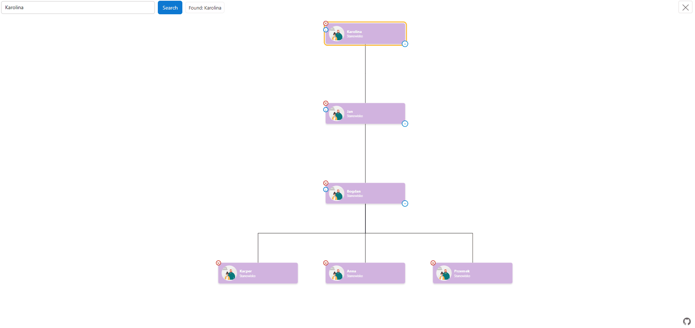
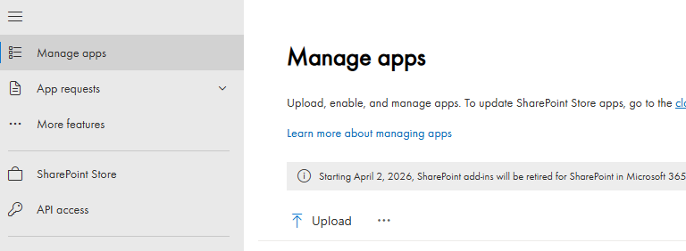
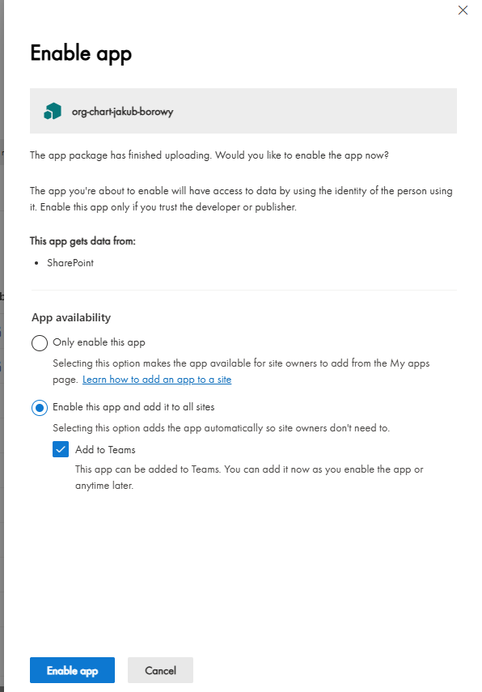
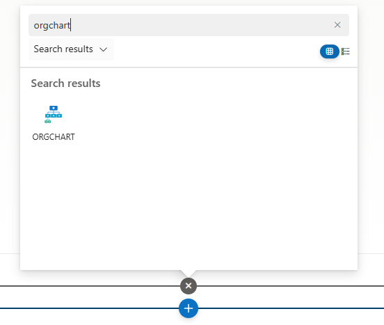
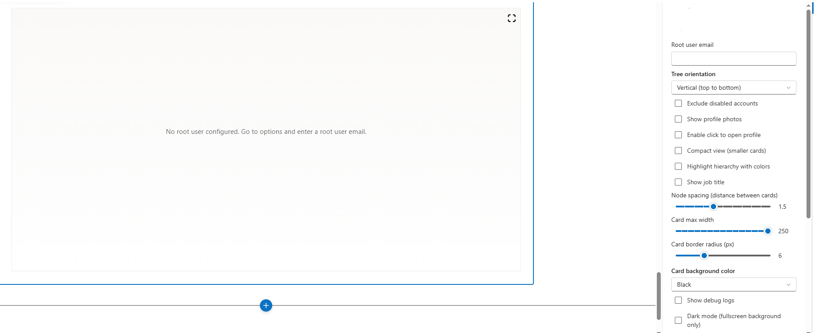

# Org Chart (SPFx)

A SharePoint Online web part that visualizes organizational structure using Microsoft Graph.

## Features

- movable view allows grab and move the view with the mouse
- enable/disable search engine search for person + move screen to person
- set root user by email
- expanding branches downwards if the user has subordinates
- removing users from the tree
- restoring users to the tree
- enable/disable dark mode in fullscreen mode
- enable/disable logs
- enable/disable inactive accounts
- set max tile size
- set distance from other tiles
- enable/disable show photos of people
- enable/disable show titles of people
- change tile backgroundcolor + floating on-screen color picker
- change color of the border of tiles belonging to the same supervisor
- enable/disable clicking on the tile - takes you to the person's profile
- node height slider
- side panel with account info
- fullscreen centering + preserved tree state

## How to Install

### Prerequisites

- Download the latest `.sppkg` package from GitHub [Releases](https://github.com/Jakbor32/org-chart-spfx/releases)

### Deployment Steps

1. **Open SharePoint Admin Center** → `Manage apps`

   

2. **Upload the package**
   - Click `Upload`
   - Select the `.sppkg` file downloaded in step 1

     

3. **Deploy and approve permissions**
   - Click `Deploy`
   - Approve API permissions when prompted (User.Read.All, Group.Read.All)

4. **Add web part to SharePoint page**
   - Navigate to your SharePoint site
   - Edit a page and add the `Org Chart` web part

     

5. **Configure the web part**
   - Set `Root user email` (the manager whose hierarchy to display)
   - Configure additional options: photos, dark mode, compact view, etc.
   - Publish the page

     

## Component Version

| Version   | Release date | Notes                                                                                                                |
| --------- | ------------ | -------------------------------------------------------------------------------------------------------------------- |
| `1.2.0.0` | 2026-03-18   | Export chart to PDF/PNG, live search suggestions, F11 fullscreen, path highlight from user to root, improved preview |
| `1.1.0.0` | 2026-03-12   | Side panel, node height slider, on-screen color picker, fullscreen centering, search improvements, bug fixes         |
| `1.0.0.0` | 2026-03-08   | Initial release                                                                                                      |

## License

**MIT License**
